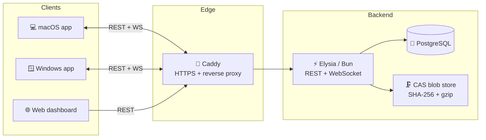

<div align="center">


# FileSync

### 🔄 Self-hosted, real-time file synchronization for all your devices

Keep your folders perfectly in sync across every machine — **in real time**, on **your own hardware**, with graceful conflict resolution and nothing ever leaving your control.

<br />

[](https://github.com/hortjar/file-sync/actions/workflows/ci.yml)
[](https://github.com/hortjar/file-sync/releases)
[](#-license)
[](#-contributing)
[](#-quick-start-production)

<br />


<br />

**[✨ Features](#-features) · [🚀 Quick Start](#-quick-start-production) · [🏗️ Architecture](#️-architecture) · [📦 Downloads](https://github.com/hortjar/file-sync/releases) · [📖 Docs](docs)**

</div>

---

## ✨ Features

|                                    |                                                                                                    |
| ---------------------------------- | -------------------------------------------------------------------------------------------------- |
| ⚡ **Real-time sync**              | Bidirectional, push-based sync over a persistent WebSocket — edits land in moments.                |
| 🔀 **Conflict resolution**         | Per-file version tracking with **Keep Mine / Keep Theirs / Keep Both** — never a silent overwrite. |
| 🗜️ **Content-addressable storage** | Files stored by SHA-256 hash, gzip-compressed, deduplicated, and ref-counted.                      |
| 🖥️ **Native desktop apps**         | Lightweight Tauri clients for macOS & Windows with system-tray integration.                        |
| ⬇️ **Automatic updates**           | The desktop app polls GitHub for signed releases and updates in place — stable & beta channels.    |
| 🏠 **Self-hosted**                 | One Docker Compose command brings up the whole stack with automatic HTTPS.                         |
| 🔒 **Private by design**           | JWT auth with short-lived access + rotating refresh tokens; per-user file isolation.               |
| 🧩 **Multi-device linking**        | Connect as many machines as you like — each registers and links to the folders you pick.           |
| 📁 **Selective folders**           | Sync exactly the directories you choose, mapped independently across devices.                      |
| 👀 **Instant file watching**       | A native Rust file-system watcher catches changes the moment they touch disk.                      |
| 📊 **Web dashboard**               | Monitor folders, devices, storage, and live request metrics from any browser.                      |
| 🔔 **Logs & notifications**        | Per-device log upload, error reporting, health checks, and notifications.                          |
| 🎨 **Themeable & localized**       | Seven accent colors, light/dark modes, and full internationalization.                              |

---

## 🧩 Tech Stack

| Layer      | Technology                                                           |
| ---------- | -------------------------------------------------------------------- |
| 🖥️ Desktop | **Tauri v2** (React + TypeScript + Rust), Rust `notify` file watcher |
| 🌐 Web     | **React** SPA, **Vite**, **TanStack Query**, **Tailwind CSS**        |
| ⚡ Server  | **Elysia** on **Bun**, JWT auth, WebSockets                          |
| 🗄️ Data    | **PostgreSQL** + **Drizzle ORM**, Content-Addressable blob storage   |
| 🚢 Deploy  | **Docker Compose**, **Caddy** (automatic HTTPS via Let's Encrypt)    |

---

## 🏗️ Architecture



<details>
<summary><strong>🔬 How sync works under the hood</strong></summary>

<br />

**Content-Addressable Storage (CAS)** — Files are stored on the server by SHA-256 hash at `STORAGE_PATH/blobs/<hash[0:2]>/<hash>`, gzip-compressed. Identical content across users and folders is stored only once. Ref-counting garbage-collects unreferenced blobs.

**Real-time sync flow**

1. 🦀 The Rust `notify` crate watches linked local directories and emits `fs:change` Tauri events to the frontend.
2. 🧮 The sync engine debounces events (300 ms), hashes the file, calls `POST /api/sync/check` to detect conflicts, then uploads via multipart to `POST /api/sync/upload`.
3. 📡 The server broadcasts a `file:changed` WebSocket message to all other connected devices of the same user.
4. ⬇️ Each device's WS client downloads the new file and marks it as an expected write to prevent echo-loop re-uploads.

**Conflict detection** — The check endpoint uses per-file version numbers tracked on the desktop (`stores/file-versions.ts`). If the server holds a version the client hasn't synced from, a conflict record is created and the upload is rejected. The Conflicts page lets users choose: **Keep Mine**, **Keep Theirs**, or **Keep Both** (saves the other version with a conflict suffix).

**WebSocket authentication** — Browser WebSockets cannot set custom headers, so auth uses query params: `wss://server/ws?token=<jwt>&deviceId=<id>`.

</details>

---

## 🚀 Quick Start (Production)

> **Prerequisites:** 🐳 Docker · Docker Compose v2 · Git · a domain pointing to your server

### One-line installer (recommended)

The interactive setup script ([`scripts/setup.sh`](scripts/setup.sh) for Linux/macOS,
[`scripts/setup.ps1`](scripts/setup.ps1) for Windows) is the fastest way to self-host.
Run it straight from GitHub:

```bash
# Linux & macOS
curl -fsSL https://raw.githubusercontent.com/hortjar/file-sync/main/scripts/setup.sh | sh
```

```powershell
# Windows (PowerShell, Docker Desktop)
irm https://raw.githubusercontent.com/hortjar/file-sync/main/scripts/setup.ps1 | iex
```

The same guide is published in-app at **`https://your-domain/quick-start`** (and linked
from the landing page).

**What it does, start to finish:**

1. **Verifies prerequisites** — Git, Docker, the Docker daemon, and Compose v2. Missing
   tools abort with a clear, colorized list instead of a half-finished install.
2. **Clones (or updates) the repo** into a directory you choose — re-running is safe.
3. **Prompts in sections:**
   - _Domain & access_ — your public domain and the dashboard URL (sensible defaults).
   - _Data storage_ — keep Docker-managed named volumes, or bind blobs / database / TLS
     certs to a host directory you pick.
   - _Secrets_ — press Enter to auto-generate strong `POSTGRES_PASSWORD`, `JWT_SECRET`,
     and `JWT_REFRESH_SECRET`, or paste your own.
   - _Advanced (optional)_ — CORS origins, port, storage path, `NODE_ENV` — each with a
     default you can Enter straight through.
4. **Writes `.env.prod`** (and, for custom storage, a `docker-compose.binds.yml` override).
5. **Builds and launches** the full stack with `docker compose … up -d --build`.
6. **Offers to seed** the default admin account, then **prints your URLs**.

Everything is logged to a timestamped file, and the script reports success/error states
as it goes. Re-run it any time to update configuration or pull a newer build.

### Manual setup

```bash
# 1. Copy and fill environment variables
cp .env.example .env.prod
# Set POSTGRES_PASSWORD, JWT_SECRET, JWT_REFRESH_SECRET to long random strings,
# and set FILESYNC_DOMAIN + VITE_SERVER_URL to your domain.

# 2. Start everything (builds images; migrations run automatically on startup)
docker compose --env-file .env.prod -f docker-compose.prod.yml up -d --build
```

The domain is configured via the `FILESYNC_DOMAIN` variable (Caddy substitutes it at load time) — you no longer need to edit the `Caddyfile`. The `--env-file` flag feeds the `${VAR}` placeholders in `docker-compose.prod.yml`.

> 🐧 **Deploying with Portainer on Ubuntu?** Follow the step-by-step guide: [docs/deploy-portainer-ubuntu.md](docs/deploy-portainer-ubuntu.md).

**The stack after startup:**

| URL                             | Service                                          |
| ------------------------------- | ------------------------------------------------ |
| `https://your-domain/`          | 🏠 Marketing landing page (features + downloads) |
| `https://your-domain/downloads` | 📦 Desktop client downloads (OS-detected + all)  |
| `https://your-domain/admin`     | 📊 Web dashboard (login, folders, devices, logs) |
| `https://your-domain/api`       | 🔌 REST API (used by desktop + web)              |
| `https://your-domain/ws`        | 📡 WebSocket (real-time push to desktop clients) |

The landing page and dashboard are the same SPA, so the Caddy/nginx routing is unchanged — everything outside `/api`, `/ws`, and `/health` is served from `index.html`.

🔒 HTTPS is handled automatically by Caddy (Let's Encrypt). Ports 80/443 must be reachable from the internet.

📥 Download the desktop app from the landing page (or the [Releases](https://github.com/hortjar/file-sync/releases) page), open it, enter `https://your-domain` as the server URL, and sign in.

---

## 🛠️ Development Setup

> **Prerequisites:** 🍞 Bun 1.x · 🦀 Rust 1.88+ · 🐳 Docker (for PostgreSQL)

<details open>
<summary><strong>Step-by-step</strong></summary>

<br />

```bash
# 1. Install dependencies
bun install

# 2. Configure environment
cp .env.dev.example .env.dev

# 3. Start the local database (PostgreSQL in Docker on :5432)
bun run db

# 4. Run migrations and seed (creates admin@email.com / password — idempotent)
bun run migrate
bun run seed

# 5. Start server + desktop together
bun run dev
```

Or run pieces separately:

```bash
bun run dev:server  # server only (:3001)
bun run dev:desktop # desktop only (separate terminal)
bun run dev:web     # web dashboard only (:5173, connects to :3001)
```

🔁 **Regenerate API types** after any server route change (server must be running first):

```bash
bun run generate:api
```

</details>

---

## 📦 Project Structure

```
file-sync/
├── 🔐 Caddyfile                 # Reverse proxy — routes / to web, /api to server
├── 🐳 docker-compose.prod.yml   # Production: postgres + server + web + caddy
├── 🐳 docker-compose.dev.yml    # Dev in Docker: postgres + server (hot reload)
├── 🐳 docker-compose.local.yml  # Local dev: postgres only
│
├── 📦 packages/
│   ├── shared/                  # @file-sync/shared — types, constants, sync protocol
│   └── ui/                      # @file-sync/ui — shared React components + theme system
│
└── 🚀 apps/
    ├── server/                  # Elysia API server (port 3001)
    │   └── src/
    │       ├── routes/          # auth, devices, sync-folders, sync, conflicts, logs
    │       ├── ws/              # WebSocket connections + broadcast
    │       ├── services/        # CAS blob storage, path sanitizer
    │       └── db/              # Drizzle schema, migrations, seed
    ├── desktop/                 # Tauri v2 desktop app
    │   └── src/
    │       ├── pages/           # Login, SyncFolders, Conflicts, Settings, Logs
    │       ├── services/        # sync engine, ws client, uploader, downloader, reconciler
    │       ├── stores/          # auth, links, file-versions, sync-status, theme
    │       └── generated/       # HeyApi typed client + TanStack Query hooks
    └── web/                     # React SPA — landing, downloads & dashboard (Vite + React Router)
        └── src/
            ├── pages/           # Landing, Downloads, Dashboard, Folders, Devices, Logs, Login
            ├── components/      # landing/, AppLayout, ProtectedRoute, shared UI
            └── generated/       # HeyApi typed client + TanStack Query hooks
```

---

## 🐳 Docker Compose Environments

| File                       | Purpose                                                                 |
| -------------------------- | ----------------------------------------------------------------------- |
| `docker-compose.local.yml` | 🧪 Local dev — PostgreSQL only. Run server locally with `bun run dev`.  |
| `docker-compose.dev.yml`   | 🔧 Dev in Docker — PostgreSQL + server with hot reload. Source mounted. |
| `docker-compose.prod.yml`  | 🚀 Production — postgres + server + web + Caddy (HTTPS).                |

```bash
bun run db                                                                    # local: postgres only
docker compose -f docker-compose.dev.yml up -d                                # dev: postgres + server
docker compose --env-file .env.prod -f docker-compose.prod.yml up -d --build  # prod: full stack with HTTPS
```

---

## ⚙️ Environment Variables

| Variable             | Required | Description                                                      |
| -------------------- | -------- | ---------------------------------------------------------------- |
| `DATABASE_URL`       | ✅ Yes   | PostgreSQL connection string                                     |
| `JWT_SECRET`         | ✅ Yes   | Secret for access token signing (15 min TTL)                     |
| `JWT_REFRESH_SECRET` | ✅ Yes   | Secret for refresh token signing (7 day TTL)                     |
| `POSTGRES_PASSWORD`  | 🚀 Prod  | PostgreSQL password for Docker Compose                           |
| `FILESYNC_DOMAIN`    | 🚀 Prod  | Domain Caddy serves + requests the TLS cert for                  |
| `VITE_SERVER_URL`    | 🚀 Prod  | Server URL baked into the web build (e.g. `https://your-domain`) |
| `CORS_ORIGIN`        | ⬜ No    | Allowed origins (default: `*`)                                   |
| `PORT`               | ⬜ No    | Server port (default: `3001`)                                    |
| `STORAGE_PATH`       | ⬜ No    | Blob storage directory (default: `./data/blobs`)                 |
| `NODE_ENV`           | ⬜ No    | `development` or `production`                                    |

---

## 💻 Building the Desktop App

**🍎 macOS (Apple Silicon)**

```bash
bun run build:mac
# Output: apps/desktop/src-tauri/target/aarch64-apple-darwin/release/bundle/macos/FileSync.app
```

**🤖 CI / GitHub Actions** — push a `v*` tag to trigger the build workflow, which attaches macOS `.dmg` and Windows `.exe` installers to a draft GitHub Release:

```bash
git tag v1.0.0 && git push origin v1.0.0      # stable release
git tag v1.1.0-beta && git push origin v1.1.0-beta   # auto-published as a prerelease
```

### ⬇️ Automatic updates

The desktop client keeps itself current — there's nothing to reinstall:

- **Self-updating.** On startup (and every 6 hours) the app polls the GitHub releases
  API for a newer build and surfaces it in the sidebar.
- **Signed manifests.** Updates are verified against the app's public key before they're
  applied, so only releases you signed can install.
- **Stable & beta channels.** Users on the **stable** channel only see `v*` releases;
  the **beta** channel also picks up `-beta` prereleases for early access. Switch
  channels in the desktop app's settings.
- **Install on your terms.** The app never restarts on its own — it downloads in the
  background and waits for you to click **Download & install**, then relaunches into the
  new version. A desktop notification lets you know when one is ready.

> Releases are built and published by GitHub Actions; tagging `v*` cuts a stable release
> and `*-beta` an automatic prerelease for the beta channel.

---

## 🚢 Deployment Notes

<details>
<summary><strong>🌐 Domain &amp; HTTPS</strong></summary>

<br />

`Caddyfile` routes traffic on the domain set via `FILESYNC_DOMAIN` (default `localhost`). Caddy substitutes `{$FILESYNC_DOMAIN}` at load time, so you configure the domain through the environment, not by editing the file:

- `/` → landing page + web dashboard at `/admin` (nginx serving built SPA)
- `/api/*` → Elysia API server
- `/ws` → WebSocket
- `/health`, `/openapi/*`, `/swagger*` → Elysia server

Caddy obtains a Let's Encrypt certificate automatically on first start. Ports 80 and 443 (TCP + UDP) must be open.

</details>

<details>
<summary><strong>👤 First login</strong></summary>

<br />

There is no sign-up screen — create the default admin account by seeding:

```bash
docker compose -f docker-compose.prod.yml exec server bun run apps/server/src/db/seed.ts
```

This creates `admin@email.com` / `password` (idempotent). **Change the password after first login.**

</details>

<details>
<summary><strong>♻️ Updating</strong></summary>

<br />

```bash
docker compose --env-file .env.prod -f docker-compose.prod.yml up -d --build
```

Migrations run automatically on server startup.

</details>

<details>
<summary><strong>🔗 CORS</strong></summary>

<br />

The server uses `origin: true` (allow all). In production the web app makes same-origin requests (no CORS needed), while desktop clients connect from Tauri's webview origin. This setting is safe for a self-hosted setup.

</details>

---

## 🧹 Linting & Type Checking

```bash
bun run lint         # 💅 Prettier check + ESLint (all workspaces)
bun run typecheck    # 🔷 TypeScript (server + packages)
bun run format       # ✨ Prettier write
```

---

## 🤝 Contributing

Contributions are welcome! 🎉

1. 🍴 Fork the repo and create your branch from `main`.
2. ✅ Make sure `bun run lint` and `bun run typecheck` pass.
3. 📬 Open a pull request describing your change.

---

## 📄 License

**FileSync** is open source and free to use, modify, and self-host. 💜

<div align="center">
<br />

Built with ❤️ using **Tauri**, **Elysia** & **Bun**

⭐ Star this repo if you find it useful!

</div>
